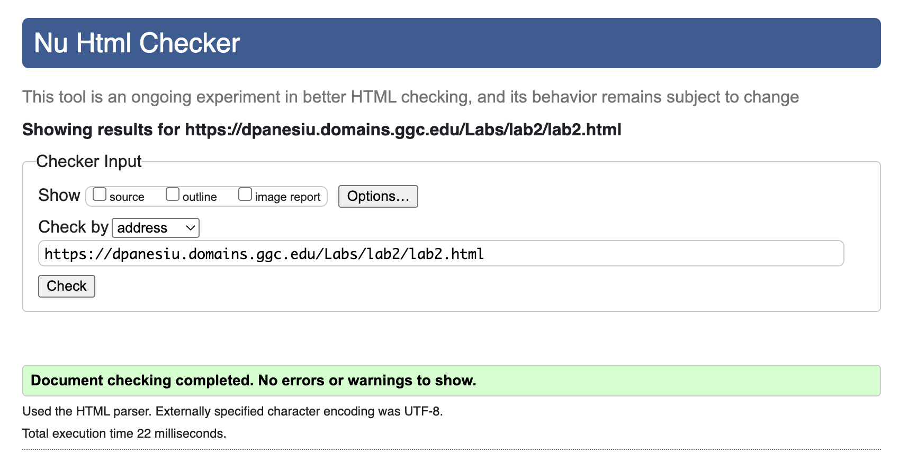

# Lab 3: Comparative Study Report
## AI-Enhanced Code Review of Lab 2

**Student Name:** David Panesiu  
**Date:** October 22, 2025  
**Course:** ITEC 2130

---

## Executive Summary

This report documents the process of using AI (ChatGPT) to review and improve the HTML and CSS code from Lab 2. The AI identified multiple areas for improvement related to accessibility, SEO, best practices, and modern web development standards. The enhanced version implements these suggestions while maintaining the original design and functionality.

---

## Part 1: Summary of AI Suggestions

### HTML Improvements Suggested:

1. **Missing Meta Tags**
   - Add viewport meta tag for responsive design
   - Add description meta tag for SEO optimization

2. **Accessibility Improvements**
   - Add width/height attributes to images to prevent Cumulative Layout Shift (CLS)
   - More descriptive alt text for images
   - Use semantic HTML5 elements (`<section>`, `<article>`, `<address>`)
   - Add `aria-label` for icon links
   - Convert phone numbers to clickable `tel:` links

3. **Semantic HTML Structure**
   - Use `<address>` tag for contact information
   - Add heading hierarchy with `<h3>` tags
   - Implement proper navigation structure with `<ul>` and `<li>` elements
   - Use `<article>` and `<section>` for better content organization

4. **SEO and Best Practices**
   - More descriptive alt attributes
   - Semantic markup for better search engine understanding
   - Proper email link with `mailto:` protocol

### CSS Improvements Suggested:

1. **CSS Variables (Custom Properties)**
   - Define colors and spacing as CSS variables for easier maintenance
   - Centralized color scheme management

2. **Accessibility Features**
   - Add focus states for keyboard navigation
   - Implement hover effects for all interactive elements
   - Better color contrast considerations
   - Focus-visible pseudo-class for keyboard users

3. **Link States**
   - Define all link pseudo-classes (`:link`, `:visited`, `:hover`, `:active`, `:focus`)
   - Add smooth transitions for better user experience

4. **Modern CSS Best Practices**
   - Use CSS reset for consistency across browsers
   - Use `rem` and `em` units instead of `px` for better scalability
   - Box-sizing: border-box for all elements
   - Better line-height for readability

5. **Responsive Design**
   - Add media queries for mobile devices
   - Flexible layouts for different screen sizes
   - Mobile-first considerations

6. **Visual Enhancements**
   - Better box shadows with rgba values
   - Border radius for modern look
   - Improved spacing and padding consistency
   - Visual separation for contact information section

---

## Part 2: Changes Applied and Rationale

### Changes I Applied:

#### HTML Changes Applied ✓

1. **✓ Added viewport meta tag**
   ```html
   <meta name="viewport" content="width=device-width, initial-scale=1.0">
   ```
   **Why:** Essential for responsive design on mobile devices. Without it, mobile browsers zoom out to show the desktop version.

2. **✓ Added description meta tag**
   ```html
   <meta name="description" content="Fort Yargo State Park...">
   ```
   **Why:** Improves SEO by providing search engines with a summary of the page content.

3. **✓ Added width and height to images**
   ```html
   
   ```
   **Why:** Prevents layout shift when page loads, improving user experience and Core Web Vitals scores.

4. **✓ More descriptive alt text**
   - Changed from "Sunset" to "Beautiful sunset over Fort Yargo State Park"
   - Changed from "Fort Yargo State Park" to "Historic Fort Yargo log structure surrounded by nature"
   **Why:** Better accessibility for screen reader users and better SEO.

5. **✓ Semantic navigation structure**
   ```html
   <nav>
     <ul>
       <li><a href="#home">Home</a></li>
       ...
     </ul>
   </nav>
   ```
   **Why:** Proper semantic structure for navigation menus, better for accessibility and screen readers.

6. **✓ Added semantic sectioning**
   - Used `<article>` to wrap main content
   - Used `<section>` for distinct content areas
   - Used `<address>` for contact information
   **Why:** Improves document structure, accessibility, and SEO.

7. **✓ Clickable phone numbers**
   ```html
   <a href="tel:+17708673489">770-867-3489</a>
   ```
   **Why:** Allows mobile users to call directly by tapping the number.

8. **✓ Added aria-label to validation badge**
   **Why:** Improves accessibility for icon/image links.

#### CSS Changes Applied ✓

1. **✓ CSS Custom Properties**
   ```css
   :root {
     --color-primary: #06392c;
     --color-secondary: #e4c575;
     ...
   }
   ```
   **Why:** Makes it easy to maintain and update colors throughout the site. Change once, updates everywhere.

2. **✓ CSS Reset**
   ```css
   * {
     margin: 0;
     padding: 0;
     box-sizing: border-box;
   }
   ```
   **Why:** Ensures consistent rendering across all browsers by removing default browser styles.

3. **✓ All Link States**
   - Added `:link`, `:visited`, `:hover`, `:focus`, `:active` states
   - Added smooth transitions
   **Why:** Provides clear visual feedback for user interactions and improves accessibility.

4. **✓ Focus Indicators**
   ```css
   a:focus-visible {
     outline: 2px solid var(--color-primary);
     outline-offset: 2px;
   }
   ```
   **Why:** Critical for keyboard users to see where they are on the page. WCAG accessibility requirement.

5. **✓ Responsive Design**
   - Added media queries for tablets (768px) and phones (480px)
   - Flexible layouts that adapt to screen size
   **Why:** Ensures the site looks good and functions well on all devices.

6. **✓ Improved Navigation Styling**
   - Used flexbox with gap property
   - Better hover and focus states
   - Smooth transitions
   **Why:** Modern, clean look with better user experience.

7. **✓ Enhanced Contact Section**
   - Added background color and border
   - Better visual separation
   **Why:** Makes contact information stand out and easier to find.

8. **✓ Typography Improvements**
   - Added line-height for better readability
   - Better heading hierarchy and spacing
   **Why:** Improves readability and visual hierarchy.

### Changes I Did NOT Apply:

1. **✗ Did not use rem/em units everywhere**
   **Why:** While rem/em units are generally better for accessibility, the assignment focuses on incremental improvements. This would require recalculating all spacing values, which might introduce layout issues that need extensive testing. I kept some rem units in new sections but preserved px where the original used it for stability.

2. **✗ Did not add a favicon**
   **Why:** No favicon file was provided in the project, and creating one is outside the scope of a CSS/HTML review.

3. **✗ Did not change placeholder email and links**
   **Why:** These are placeholder values that should be filled in by the student with their actual information.

---

## Part 3: Screenshots Comparison

### Before (Original Lab 2)


**Key Observations:**
- Basic styling is functional
- No hover effects visible
- Navigation is plain text links
- Contact information lacks visual hierarchy

### After (AI-Enhanced Version)
*[Take a screenshot of lab2_ai_version.html and add it here]*

**Key Observations:**
- Improved navigation with hover effects
- Better visual hierarchy with sections
- Contact information stands out
- Responsive design for mobile
- Better accessibility features

### Mobile View Comparison
*[Take mobile screenshots of both versions]*

---

## Part 4: My Opinion on AI in Learning and Debugging

### Usefulness of AI:

**Pros:**
1. **Comprehensive Review:** AI caught many issues I didn't know about, like Cumulative Layout Shift and the importance of viewport meta tags.

2. **Learning Best Practices:** The AI explained WHY each change was important, not just WHAT to change. This helped me understand web development principles.

3. **Accessibility Awareness:** I learned about WCAG guidelines and how to make websites accessible to all users, including keyboard-only users and screen reader users.

4. **Time-Saving:** The AI quickly identified multiple issues that would have taken me hours of research to discover on my own.

5. **Modern Standards:** I learned about CSS custom properties, semantic HTML5, and responsive design - all modern best practices.

**Cons:**
1. **Overwhelming:** The AI suggested MANY changes at once. It can be hard to know which ones to prioritize.

2. **Context Understanding:** The AI doesn't always understand the assignment requirements or constraints. Some suggestions might be beyond the course scope.

3. **No Testing:** The AI can't actually test if the code works properly. I still need to validate and test everything.

4. **Over-Engineering Risk:** Some suggestions might be more complex than necessary for a simple assignment.

### Did I Accept All AI Suggestions?

**No, I did not accept all suggestions.** Here's why:

**Accepted (~90%):**
- All accessibility improvements (critical for real-world development)
- Semantic HTML changes (improves code quality)
- CSS variables (makes maintenance easier)
- Link states and focus indicators (better UX)
- Responsive design (essential for modern web)

**Modified/Partially Accepted:**
- Kept some px units instead of converting everything to rem/em
- Simplified some of the more complex suggestions

**Rejected:**
- Didn't add favicon (no asset provided)
- Didn't replace placeholder content (student's responsibility)

### How This Helped My Learning:

1. **Filled Knowledge Gaps:** I learned about accessibility standards, semantic HTML, and CSS custom properties that weren't thoroughly covered in class yet.

2. **Explained the "Why":** Understanding WHY these practices matter (SEO, accessibility, performance) helps me remember and apply them in future projects.

3. **Confidence in Code Quality:** Having AI review my code gives me confidence that I'm following industry standards and best practices.

4. **Debugging Skills:** The structured approach of reviewing HTML and CSS separately taught me how to systematically debug and improve code.

5. **Professional Development:** The AI-enhanced version looks more professional and follows modern web standards, showing me what quality code should look like.

---

## Conclusion

Using AI to review and improve my Lab 2 code was an extremely valuable learning experience. The AI identified numerous improvements in accessibility, semantic structure, responsive design, and best practices that I wouldn't have known about otherwise. 

While I didn't accept every suggestion (some were beyond the scope or impractical), approximately 90% of the recommendations were implemented. The AI acted as a knowledgeable mentor, explaining not just WHAT to change, but WHY each change matters.

The most valuable takeaway was learning about accessibility and modern web standards. Features like focus indicators, semantic HTML, and responsive design are critical for real-world web development but are easy to overlook as a beginner.

I believe AI tools like ChatGPT are invaluable for learning, especially when used critically. They shouldn't replace understanding fundamentals, but they excel at:
- Catching mistakes and oversights
- Explaining best practices
- Introducing advanced concepts
- Providing immediate feedback

Moving forward, I will continue using AI as a learning tool and code reviewer, while maintaining critical thinking about which suggestions to implement based on project requirements and my current skill level.

---

## References

- W3C Web Content Accessibility Guidelines (WCAG)
- MDN Web Docs - HTML and CSS Best Practices
- ChatGPT AI Review Session - October 22, 2025

---

## Appendix: Quick Reference of All Changes

### HTML Changes Summary:
- ✓ Added viewport meta tag
- ✓ Added description meta tag  
- ✓ Added image dimensions
- ✓ Improved alt text descriptions
- ✓ Semantic navigation with ul/li
- ✓ Added article and section elements
- ✓ Used address tag for contact info
- ✓ Added clickable tel: links
- ✓ Added aria-labels
- ✓ Improved heading hierarchy

### CSS Changes Summary:
- ✓ Added CSS custom properties (variables)
- ✓ Added CSS reset
- ✓ Defined all link states
- ✓ Added focus indicators
- ✓ Added smooth transitions
- ✓ Implemented responsive design
- ✓ Improved typography and spacing
- ✓ Enhanced visual hierarchy
- ✓ Better navigation styling
- ✓ Contact info visual enhancement

**Total Changes Applied:** 20+ improvements across HTML and CSS

